# 版本说明
reactnative 0.82、node 22.18.0
# 卸载全局的react-native-cli @react-native-community/cli
预防后面使用
```js
npx @react-native-community/cli init AwesomeProject --version 0.82
``` 
命令创建项目时，出现意外情况
```js
npm uninstall -g react-native-cli @react-native-community/cli
```
# 开发环境搭建
官方链接：https://www.react-native.cn/docs/environment-setup
## 关于window Android环境搭建依赖说明
根据reactnative官网指定版本的说明，确定Android studio需要安装相关依赖的版本，我当前使用的reactnative版本是0.82，需要的依赖版本是：Android 15(VanillaIceCream)、Android 15 (VanillaIceCream)、Android SDK Platform 35、Intel x86 Atom_64 System Image、Android SDK Build-Tools（35.0.0）
### Android 15(VanillaIceCream)、Intel x86 Atom_64 System Image、Android SDK Platform 35

### 官方说0.82是要Android SDK Platform 35版本，但是模板的build.gradle配置的是需要36
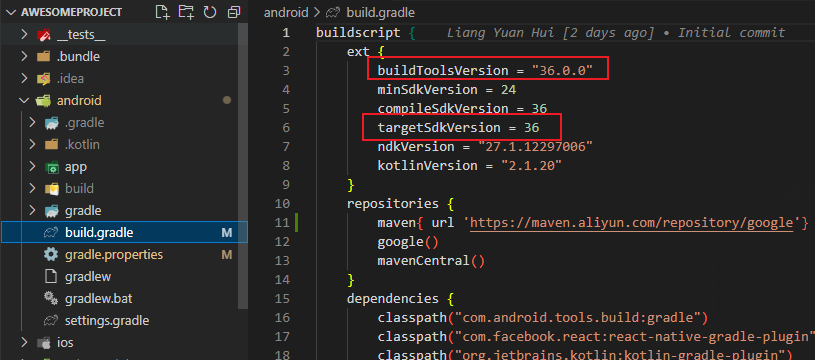

### Android SDK Build-Tools，具体版本根据android的build.gradle配置确定

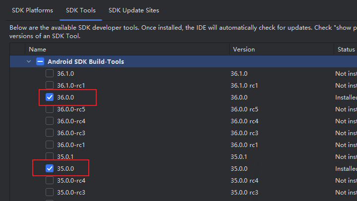
### NDK的版本也根据android的build.gradle配置确定


### CMake
CMake也勾选上

### 其他的环境变量配置，很简单，就按照官方文档上的操作配置即可，我这里就不多说了

# 使用官方脚手架初始化reactnative项目
npx 会临时安装@react-native-community/cli，用完会自动进行删除
```js
npx @react-native-community/cli init AwesomeProject --version 0.82
```
# 项目开发前先要知道的几个核心点
## 项目目录的划分
### 由于之前初始化的模板，目录划分不是很全，这里我们自己在根目录新建src目录（包括assets、components、config、models、navigator、pages、utils、index.tsx）

### 再把之前的App.tsx删除了，统一改为使用src/index.tsx
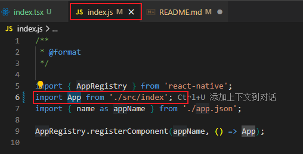
### 启动测试
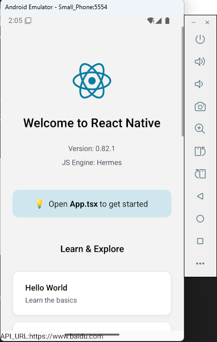
## 绝对路径的配置
### 安装依赖
```
yarn add babel-plugin-module-resolver
```
### 配置babel.config.js
```
module.exports = {
  presets: ['module:@react-native/babel-preset'],
  plugins: [
    [
      'module-resolver',
      {
        root: ['./src'],
        alias: {
          '@/utils': './src/utils',
          '@/assets': './src/assets',
          '@/config': './src/config',
          '@/models': './src/models',
          '@/pages': './src/pages',
          '@/navigator': './src/navigator',
          '@/components': './src/components',
        },
      },
    ],
  ],
};
```
### 创建测试文件
在src/utils创建测试文件
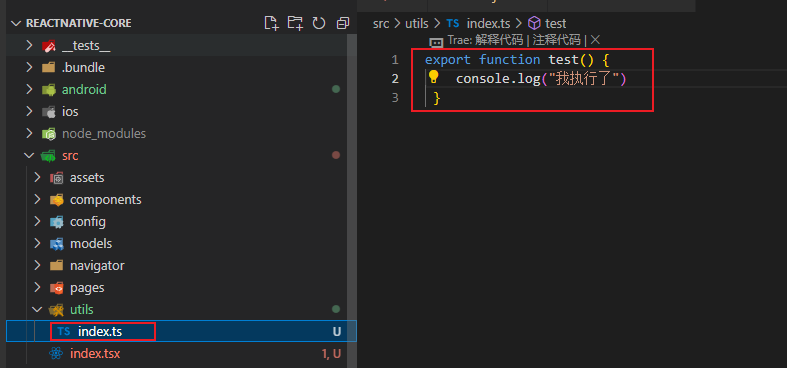
### 导入测试
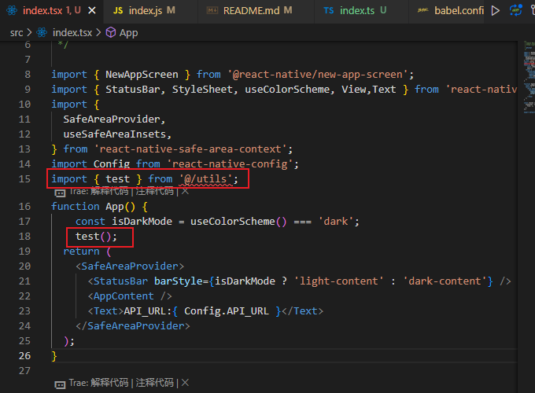
因为我们没有改动原生的代码，所以直接重新启动web服务查看效果即可
```js
# 切记，要加--reset-cache选项，重置缓存，否则会报错
yarn start --reset-cache
```
### 效果
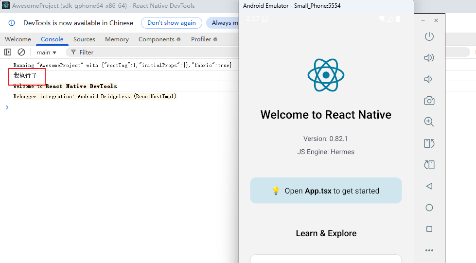
### 解决import语句，编辑器冒红色下划线提示问题
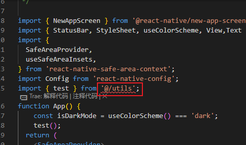
配置tsconfig.json
```
{
  "extends": "@react-native/typescript-config",
  "include": ["**/*.ts", "**/*.tsx"],
  "exclude": ["**/node_modules", "**/Pods"],
  "compilerOptions": {
    "baseUrl": "./src",
    "paths": {
      "@/assets/*": ["assets/*"],
      "@/components/*": ["components/*"],
      "@/config/*": ["config/*"],
      "@/models/*": ["models/*"],
      "@/navigator/*": ["navigator/*"],
      "@/pages/*": ["pages/*"],
      "@/utils/*": ["utils/*"]
    }
  }
}
```
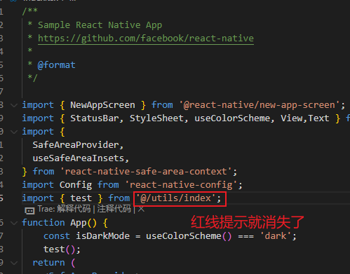
## 多环境配置
```
yarn add react-native-config
```
### 链接react-native-config
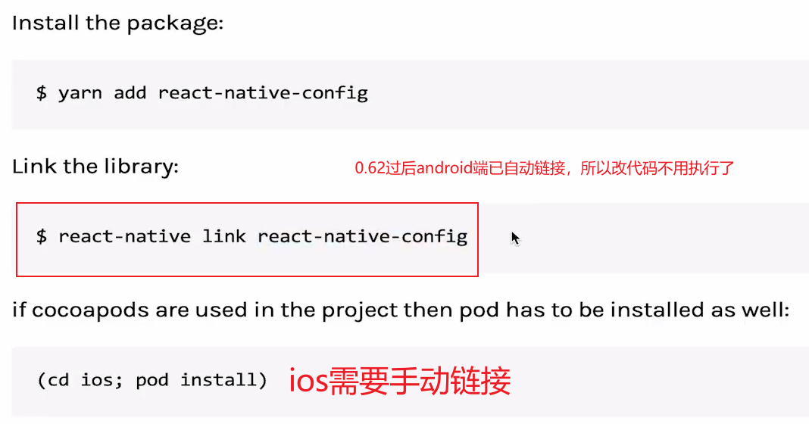
### 安卓需额外配置
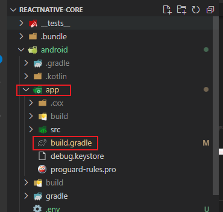
在android/app/build.gradle的最后一行加上
```
apply from: project(':react-native-config').projectDir.getPath() + "/dotenv.gradle"
```
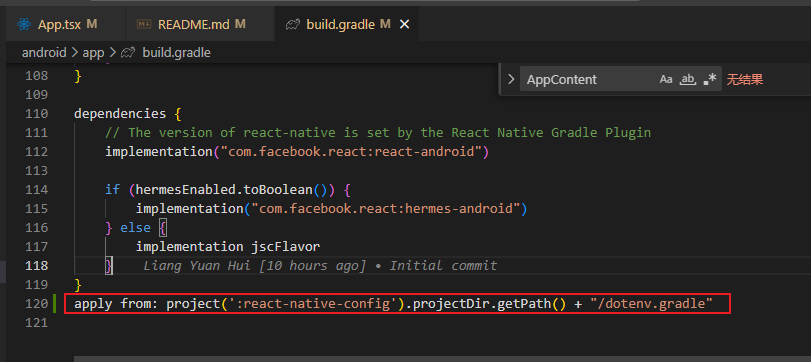
### 在项目根目录创建.env文件
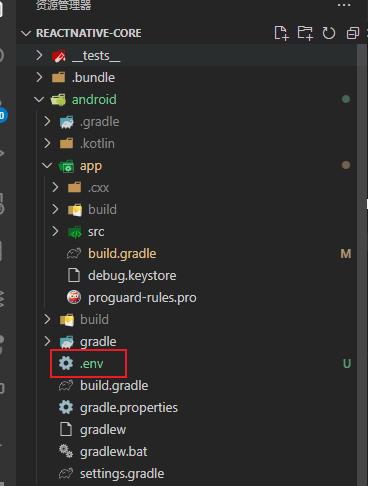
内容如下：
```
API_URL=https://www.baidu.com
```
### 重新执行打包安装
改动了build.gradle，需要重新执行yarn android进行打包安装
可以看到，在执yarn android时，已经默认读取了环境变量配置

### 测试是否生效
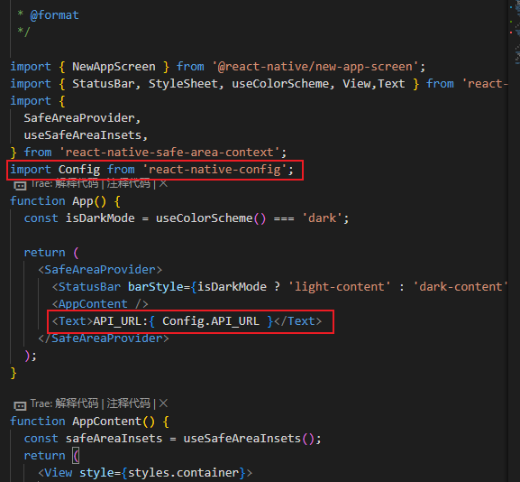
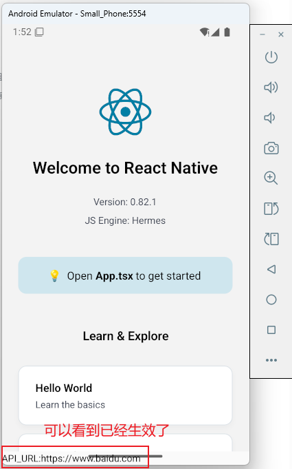
## 网络请求
```
import { memo,useState } from 'react'
import { View,Text,Button } from 'react-native'
export default memo((props) => { 
    const [list, setList] = useState([]); 
    const getData = async () => { 
        console.log("开始请求");
        fetch('https://api-v2.xdclass.net/api/teacher/v1/list').then(res => { 
            return res.json();
        }).then(res => { 
            console.log("请求数据", res)
            setList(res.data)
        })
    }
    return (
        <View style={{ alignItems:'center',width:'100%' }}>
            <Text>网络请求示例</Text>
            <Button title='开始请求数据' onPress={getData}></Button>
            <Text>{ JSON.stringify(list) }</Text>
        </View>
    )
})
```
验证请求效果
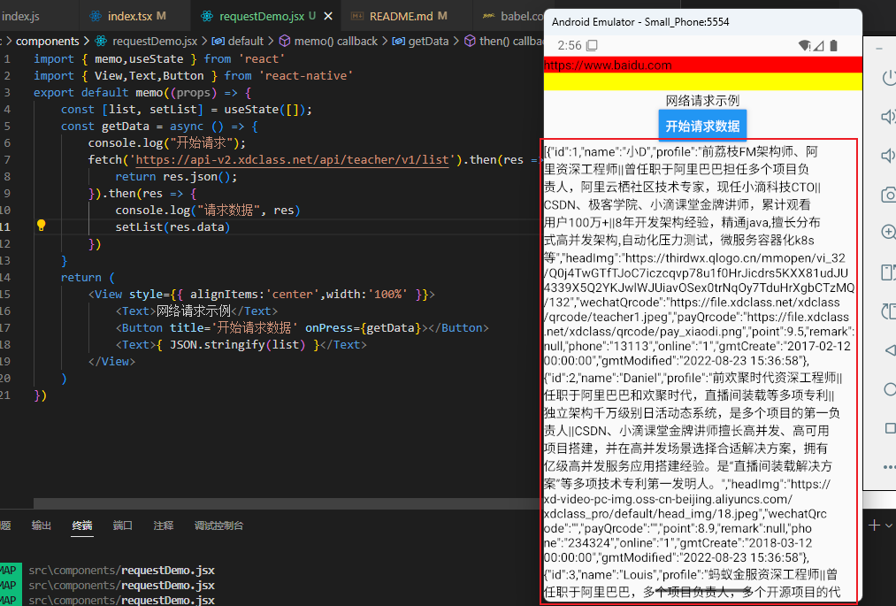

# 导航器
基于最新版（7.x）的react navication、native stack、native bottom tabs
官网链接：https://reactnavigation.org/docs/getting-started
## v7 与旧版本的主要差异
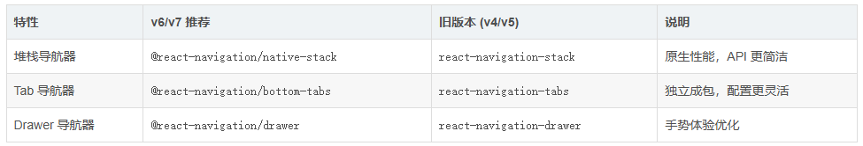
提示 ：@react-navigation/stack 已逐步被 @react-navigation/native-stack 替代，新项目强烈推荐使用后者以获得原生性能。
## 依赖安装
### 安装核心依赖
```
yarn install @react-navigation/native
```
### 添加原生能力库
这两个库是性能优化的关键，必须安装
```
yarn install react-native-screens react-native-safe-area-context
```
### 链接原生代码
ios端需要手动链接，android则是自动链接
```
npx pod-install ios 或者进入ios目录执行 pod install
```
### 按需安装导航器依赖
旧版本的导航器是需要配置一些原生配置的，新版本7.x后，就不用配置了，直接安装依赖进行引入使用
#### 堆栈导航（最常用）
```
yarn install @react-navigation/native-stack
```
#### 标签/Tab导航器
```
yarn install @react-navigation/bottom-tabs
```
#### 抽屉导航器
```
yarn install @react-navigation/drawer
```
## 路由信息统一管理
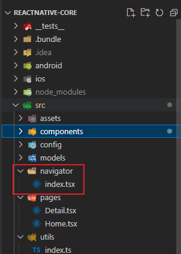

## 堆栈导航器
### 关键点解析
#### NavigationContainer ：整个应用的导航大脑，管理状态与深度链接
#### createStackNavigator 创建一个堆栈导航器。
#### Stack.Screen 定义每个屏幕，指定名称和对应的组件。
#### navigation.navigate('RouteName') ：最核心的跳转方法，自动管理堆栈
#### 所有屏幕自动接收 navigation 属性 ：无需手动传递
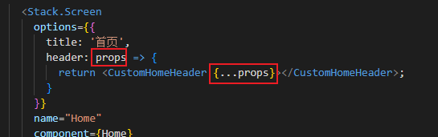
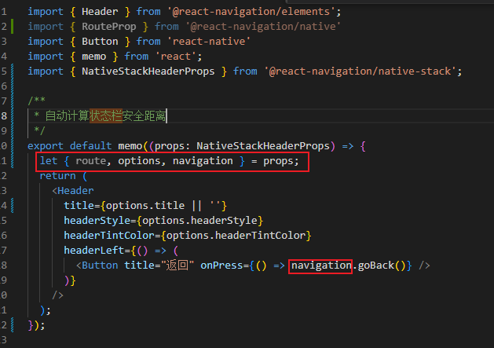
### 静态配置
链接：https://reactnavigation.org/docs/hello-react-navigation?config=static
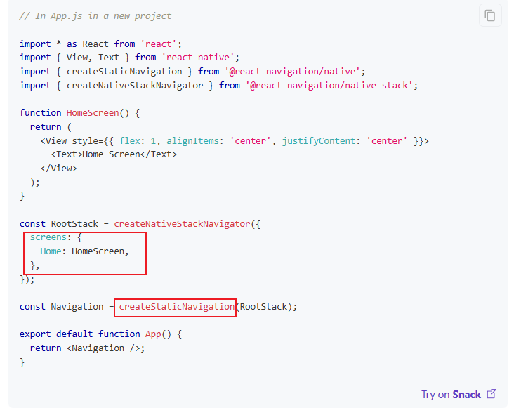
### 动态配置
链接：https://reactnavigation.org/docs/hello-react-navigation?config=dynamic
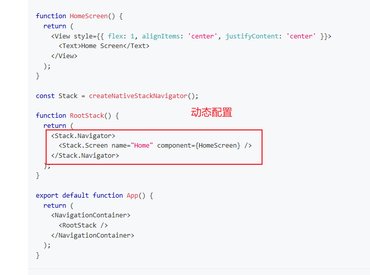
### 导航标题
#### 静态标题
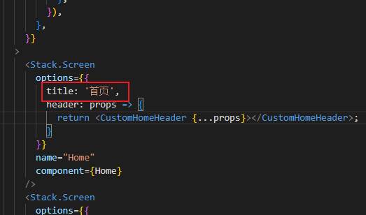
#### 动态标题

### 页面通信传参
#### 页面入参声明
比如以下详情页入参声明
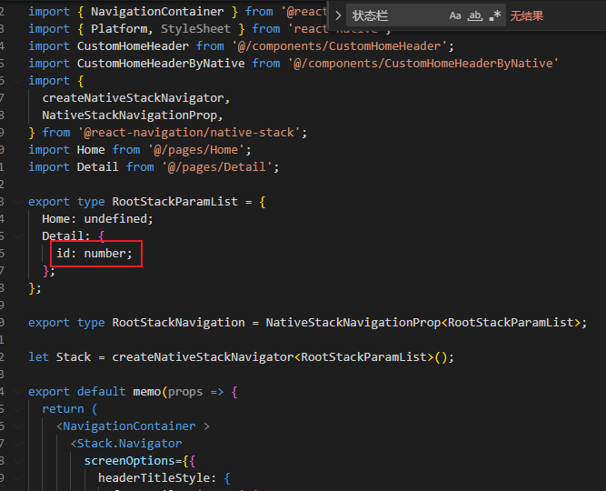
#### 跳转详情页，传入指定入参
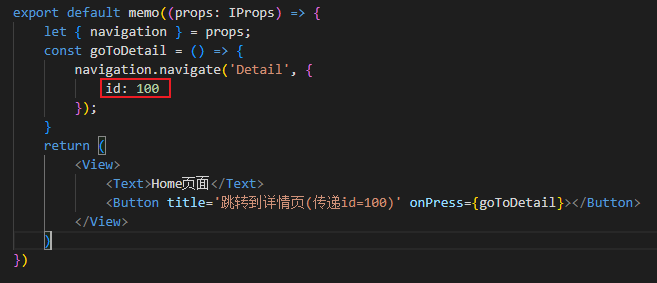
#### 详情页获取参数信息
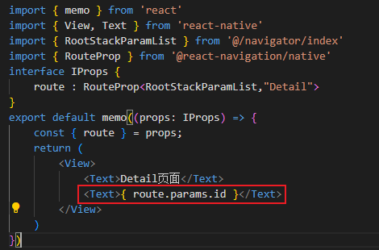
#### 最佳实践
##### 最小化参数
仅传递必要数据（如 ID），避免传递复杂对象。
##### 默认参数
通过 initialParams 设置默认值
```
<Stack.Screen
  name="Details"
  component={DetailsScreen}
  initialParams={{ itemId: 0, itemName: '未知商品' }}
/>
```

### 自定义Header容器样式
可以通过contentStyle进行设置
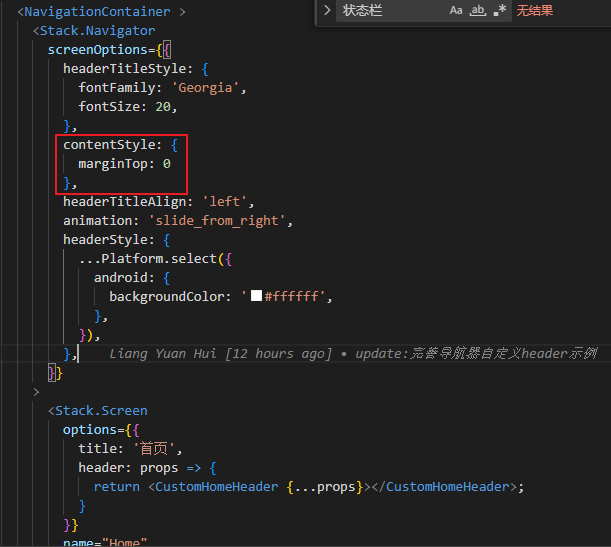
### 自定义Header
#### 自定义Header（基于@react-navigation/elements）
```
import { Header } from '@react-navigation/elements';
import { RouteProp } from '@react-navigation/native'
import { Button } from 'react-native'
import { memo } from 'react';
import { NativeStackHeaderProps } from '@react-navigation/native-stack';

/**
 * 自动计算状态栏安全距离
*/
export default memo((props: NativeStackHeaderProps) => {
  let { route, options, navigation } = props;
  return (
    <Header
      title={options.title || ''}
      headerStyle={options.headerStyle}
      headerTintColor={options.headerTintColor}
      headerLeft={() => (
        <Button title="返回" onPress={() => navigation.goBack()} />
      )}
    />
  );
});
```
#### 自定义Header（手动设置状态栏的安全区域）
```
import { memo } from 'react'
import { Text, StatusBar, View } from 'react-native';
import { useSafeAreaInsets } from 'react-native-safe-area-context';

/**
 * 需要自己计算状态栏安全距离
 */
export default memo((props) => { 
    let inset = useSafeAreaInsets();
    return (
      <View style={{ paddingTop: inset.top }}>
        {/* translucent */}
        <StatusBar translucent backgroundColor={'transparent'} />
        <Text>我是自定义头部{inset.top}</Text>
      </View>
    );
})
```

#### 应用前面写好的自定义组件
```
...
<Stack.Screen
  options={{
    title: '首页',
    header: props => {
      return <CustomHomeHeader {...props}></CustomHomeHeader>;
    }
  }}
  name="Home"
  component={Home}
/>
<Stack.Screen
  options={{
    title: '详情页',
    header: props => (
      <CustomHomeHeaderByNative {...props}></CustomHomeHeaderByNative>
    ),
  }}
  name="Detail"
  component={Detail}
/>
...
```

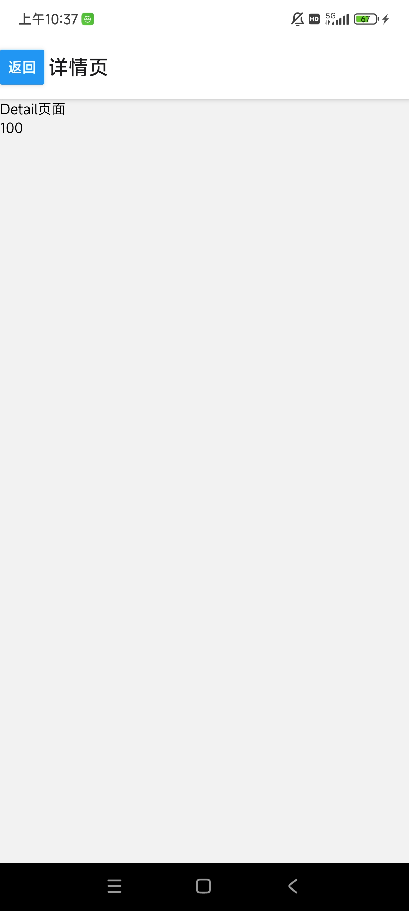

## 标签/Tab导航器
1.createNativeBottomTabNavigator目前处于实验性阶段（2025.11.29），且只支持ios、android,不支持web
2.createBottomTabNavigator，目前处于稳定版本 支持ios、android、web
### createBottomTabNavigator
```
import { createBottomTabNavigator } from '@react-navigation/bottom-tabs';
```
#### 静态配置
```
import { createBottomTabNavigator } from '@react-navigation/bottom-tabs';

const MyTabs = createBottomTabNavigator({
  screens: {
    Home: HomeScreen,
    Profile: ProfileScreen,
  },
});
```
#### 动态配置
```
import { createBottomTabNavigator } from '@react-navigation/bottom-tabs';

const Tab = createBottomTabNavigator();

function MyTabs() {
  return (
    <Tab.Navigator>
      <Tab.Screen name='Home' component={HomeScreen} />
      <Tab.Screen name='Profile' component={ProfileScreen} />
    </Tab.Navigator>
  );
}
```
### createNativeBottomTabNavigator
```
import { createNativeBottomTabNavigator } from '@react-navigation/bottom-tabs/unstable';
```
#### 动态配置
```
import { createNativeBottomTabNavigator } from '@react-navigation/bottom-tabs/unstable';
const Tab = createNativeBottomTabNavigator();
function MyTabs() {
  return (
    <Tab.Navigator>
      <Tab.Screen name='Home' component={HomeScreen} />
      <Tab.Screen name='Profile' component={ProfileScreen} />
    </Tab.Navigator>
  );
}
```
#### 静态配置
```
import { createNativeBottomTabNavigator } from '@react-navigation/bottom-tabs/unstable';
const MyTabs = createNativeBottomTabNavigator({
  screens: {
    Home: HomeScreen,
    Profile: ProfileScreen,
  },
});
```
### 标签导航器案例演示
因为createBottomTabNavigator是稳定版本，所以接下来的标签演示就拿稳定版本，来进行演示
与堆栈导航器结合使用，无非就是标签套堆栈，亦或堆栈套标签，一般我们用的是堆栈导航器套标签导航器，所以接下来演示的便是堆栈导航器套标签导航器
#### 创建ButtomsTabs.tsx
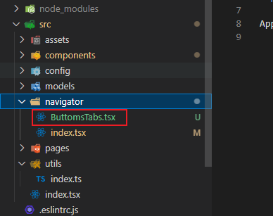
```
import Account from '@/pages/tabs/Account';
import Found from '@/pages/tabs/Found';
import Listen from '@/pages/tabs/Listen';
import Home from '@/pages/Home';
import { createBottomTabNavigator } from '@react-navigation/bottom-tabs';
import { memo,useEffect } from 'react';
import { RootStackNavigation, RootStackParamList } from '@/navigator/index';
import { RouteProp,TabNavigationState,useNavigationState } from '@react-navigation/native';

export type BottomTabParamList = {
  Index: undefined;
  Listen: undefined;
  Found: undefined;
  Account: undefined;
};

const tab = createBottomTabNavigator<BottomTabParamList>();

type Route = RouteProp<RootStackParamList, 'ButtomsTabs'> & {
  // 无法正常获取state，用hooks即可
  state?: TabNavigationState<RootStackParamList>;
};

interface IProps {
  navigation: RootStackNavigation;
  route: Route;
}

export default memo((props: IProps) => {
  let { route } = props;
  // 标签导航、堆栈导航跳转这里都会执行
  if (route) {
    console.log(route)
  }
  // 用hooks获取state状态
  const state = useNavigationState(state => state);
  // 如果不想自己判断标题展示，也可以使用bottom-tab自带的标题
  function getTitleName() {
    const stateObj = state.routes[0].state;
    if (stateObj) { 
      let routeNames = stateObj.routeNames || ['Index'];
      let index = stateObj.index || 0;
      let currentRouteName = routeNames[index];
      switch (currentRouteName) {
        case 'Index':
          return "首页"
        case 'Listen':
          return "我听";
        case 'Found':
          return "发现";
        case 'Account':
          return '账户';
        default:
          return '首页';
      }
    }
    return '首页';
  }
  useEffect(() => {
    // props.route.state无法获取state，用hooks即可
    // console.log('我变化了', props.route.state);
    let title = getTitleName();
    props.navigation.setOptions({
      title,
    });
  }, [state.routes[0].state]);

  return (
    <tab.Navigator
      screenOptions={{
        headerShown: false, // 取消tab自带的标题，否则与堆栈导航的头部重叠
      }}
    >
      <tab.Screen
        name="Index"
        component={Home}
        options={{
          title: '首页',
        }}
      ></tab.Screen>
      <tab.Screen
        name="Listen"
        options={{
          title: '我听',
        }}
        component={Listen}
      ></tab.Screen>
      <tab.Screen
        name="Found"
        options={{
          title: '发现',
        }}
        component={Found}
      ></tab.Screen>
      <tab.Screen
        name="Account"
        options={{
          title: '账户',
        }}
        component={Account}
      ></tab.Screen>
    </tab.Navigator>
  );
});

```
#### 堆栈导航器嵌套标签导航器
```
import { memo } from 'react';
import { NavigationContainer } from '@react-navigation/native';
import { Platform, StyleSheet } from 'react-native';
import CustomHomeHeader from '@/components/CustomHomeHeader';
import CustomHomeHeaderByNative from '@/components/CustomHomeHeaderByNative'
import {
  createNativeStackNavigator,
  NativeStackNavigationProp,
} from '@react-navigation/native-stack';
import ButtomsTabs, { BottomTabParamList } from '@/navigator/ButtomsTabs';
import Detail from '@/pages/Detail';
import Other from '@/pages/Other'

export type RootStackParamList = {
  ButtomsTabs: {
    title?: string;
    screen?: keyof BottomTabParamList;
  };
  Detail: {
    id: number;
  };
  Other: undefined;
};

export type RootStackNavigation = NativeStackNavigationProp<RootStackParamList>;

export type RootTabStackNavigation = NativeStackNavigationProp<BottomTabParamList>;

let Stack = createNativeStackNavigator<RootStackParamList>();

export default memo(props => {
  return (
    <NavigationContainer>
      <Stack.Navigator
        screenOptions={{
          animationDuration: 200,
          headerTitleStyle: {
            fontFamily: 'Georgia',
            fontSize: 20,
          },
          contentStyle: {
            marginTop: 0,
          },
          headerTitleAlign: 'left',
          animation: 'slide_from_right',
          headerStyle: {
            ...Platform.select({
              android: {
                backgroundColor: '#ffffff',
              },
            }),
          },
        }}
      >
        <Stack.Screen
          initialParams={{
            title: '首页',
          }}
          name="ButtomsTabs"
          options={{
            title: '首页',
            header: props => {
              return <CustomHomeHeader {...props}></CustomHomeHeader>;
            },
          }}
          key="ButtomsTabs"
          component={ButtomsTabs}
        />
        <Stack.Screen
          initialParams={{
            id: 66,
          }}
          options={{
            title: '详情页',
            header: props => (
              <CustomHomeHeaderByNative {...props}></CustomHomeHeaderByNative>
            ),
          }}
          name="Detail"
          component={Detail}
        />
        <Stack.Screen
          options={{
            title: '其他页',
            header: props => (
              <CustomHomeHeaderByNative {...props}></CustomHomeHeaderByNative>
            ),
          }}
          component={Other}
          name="Other"
        ></Stack.Screen>
      </Stack.Navigator>
    </NavigationContainer>
  );
});

```
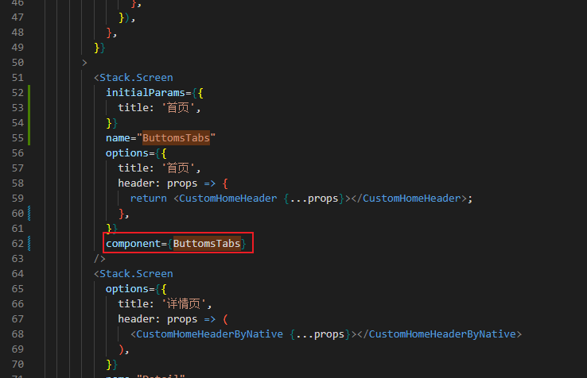
### 为Tab设置图标
链接：https://github.com/oblador/react-native-vector-icons/blob/master/packages/fontawesome6/README.md#fontawesome-6
#### 安装icon依赖
```
yarn add @react-native-vector-icons/fontawesome6
```
#### 使用icon
```
import { FontAwesome6 } from '@react-native-vector-icons/fontawesome6';
<tab.Navigator
    screenOptions={({ route }) => ({
      headerShown: false, // 取消tab自带的标题，否则与堆栈导航的头部重叠
      tabBarIcon: ({ focused, color, size }) => {
        let iconName:any;
        if (route.name === 'Index') {
          iconName = focused ? 'house-chimney' : 'house';
        } else if (route.name === 'Listen') {
          iconName = focused ? 'music' : 'music';
        } else if (route.name === 'Found') {
          iconName = focused ? 'truck-field-un' : 'truck-field-un';
        } else if (route.name === 'Account') {
          iconName = focused ? 'user' : 'user';
        }
        return (
          <FontAwesome6
            name={iconName}
            iconStyle="solid"
            size={size}
            color={color}
          />
        );
      },
      tabBarActiveTintColor: 'tomato',
      tabBarInactiveTintColor: 'gray',
    })}
  >
  ......
</tab.Navigator>
```
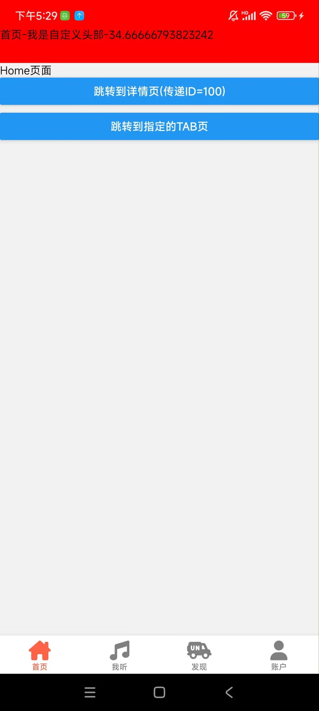
### 自定义标签栏样式
```
<Tab.Navigator
  screenOptions={{
    tabBarStyle: {
      backgroundColor: '#fff',
      borderTopWidth: 1,
      borderTopColor: '#ccc',
    },
    tabBarLabelStyle: {
      fontSize: 12,
      marginBottom: 5,
    },
  }}
>
```
### 自定义标签栏组件
```
function CustomTabBar({ state, descriptors, navigation }) {
  return (
    <View style={{ flexDirection: 'row', height: 60, backgroundColor: '#fff' }}>
      {state.routes.map((route, index) => {
        const { options } = descriptors[route.key];
        const label = options.tabBarLabel || route.name;
        const isFocused = state.index === index;

        const onPress = () => {
          const event = navigation.emit({
            type: 'tabPress',
            target: route.key,
            canPreventDefault: true,
          });

          if (!isFocused && !event.defaultPrevented) {
            navigation.navigate(route.name);
          }
        };

        return (
          <TouchableOpacity
            key={route.key}
            onPress={onPress}
            style={{ flex: 1, alignItems: 'center', justifyContent: 'center' }}
          >
            <Text style={{ color: isFocused ? 'tomato' : 'gray' }}>{label}</Text>
          </TouchableOpacity>
        );
      })}
    </View>
  );
}

<Tab.Navigator tabBar={(props) => <CustomTabBar {...props} />}>

```
### 注意事项
#### 1.iOS 26+ 上的 Liquid Glass 效果要求你的应用必须使用 Xcode 26 或更高版本。
#### 2.在安卓上，最多支持5个标签页。这是底层原生组件的局限性。 
#### 3.堆栈导航嵌套标签导航，堆栈导航跳转，也会导致标签导航重新渲染,所以，在此种嵌套的情况下，堆栈导航页面跳转到标签导航页面，最好用navigation.popTo方法，防止同时在内存中保留多份标签导航实例，占用内存，且会同时触发标签包含内部逻辑的执行，从而降低路由效率
```
// ButtomsTabs为堆栈导航页，Found为标签导航页
navigation.popTo('ButtomsTabs', {
  screen:'Found',// key名称取screen即可，reactnative会自动识别进行跳转
});
```

## 抽屉菜单
少用，这里就暂时不说了
## 深度链接
用途：让外部链接能直接打开 App 内特定页面
用到再了解即可
## useNavigation Hook：在深层组件中导航
```
import { useNavigation } from '@react-navigation/native';
function DeepChildComponent() { 
  const navigation = useNavigation(); 
  return ( <Button title="返回首页" onPress={() => navigation.navigate('Home')} /> );
}
```

## 导航器总结
React Navigation v7 通过模块化架构和原生性能优化，成为 React Native 导航的最佳选择。记住三个核心原则：
### 1.@react-navigation/native 是必需基础 ：所有项目都从此开始
### 2.根据场景选择导航器：Stack 处理页面流，Tab 负责一级导航，Drawer 提供全局菜单
### 3.嵌套而非平铺：复杂应用采用导航器组合，保持结构清晰
### 4.在 screenOptions 中设置共享样式，确保所有屏幕的头部风格统一。
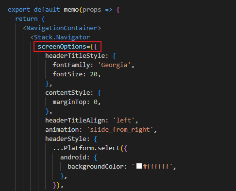
# 状态管理
链接：https://www.redux.org.cn/tutorials/quick-start.html
## 新建store目录
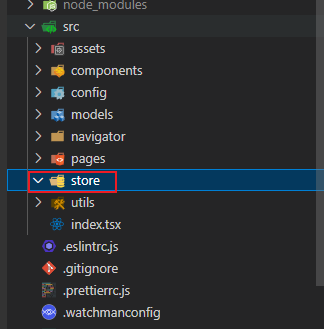
## 配置babel.config.js
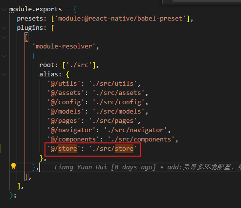
## 配置tsconfig.json
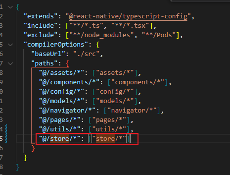

# 基本内置组件（只挑个别进行讲）
### StatusBar
>控制应用状态栏的组件（无非就显示或隐藏状态栏、状态栏安全区域占位、设置主题色、显示或隐藏时是否启用动画这三个设置）

>后一个StatusBar组件设置会覆盖前一个StatusBar组件设置

>不同的平台，配置默认值可能不同、有些配置也是针对IOS或Android特有的,这里，就不多说了，用时参考官方链接即可：https://www.react-native.cn/docs/statusbar

```
function App() {
  const isDarkMode = useColorScheme() === 'dark';
    test();
  return (
    <SafeAreaProvider>
      <StatusBar barStyle={ isDarkMode ? 'light-content' : 'dark-content' } />
      <SafeAreaView>
        <View style={{ backgroundColor:'red' } }>
          <Text>{ Config.API_URL }</Text>
        </View>
        <View style={{height:20,backgroundColor:'yellow'}}></View>
      </SafeAreaView>
    </SafeAreaProvider>
  );
}
```

## React Native 异形屏适配方案
```
yarn add react-native-safe-area-context
```
### 示例代码
```
import React from 'react'
import { SafeAreaProvider, SafeAreaView } from 'react-native-safe-area-context'
 
export default function App() {
  return (
    <SafeAreaProvider>
      <SafeAreaView>
        {/* 组件 */}
      </SafeAreaView>
    </SafeAreaProvider>
  )
}
```
SafeAreaView组件使不使用都可以，如果使用SafeAreaView组件的话,就不用自己处理状态栏高度的问题，直接把业务内容放到SafeAreaView组件内即可
### useSafeAreaInsets
仅针对被SafeAreaProvider组件包裹的业务组件，否则，调用该hook会报错(如果是react-navication导航器，内部默认使用了SafeAreaProvider包裹，所以可以在react-navication的自定义组件内部，使用useSafeAreaInsets)
#### 使用Hooks获取Safe Area Insets
您可以通过useSafeAreaInsets() hook来访问周边的安全区域值
```
import { useSafeAreaInsets } from 'react-native-safe-area-context';
 
const insets = useSafeAreaInsets();
return (
    <View style={{ paddingBottom: Math.max(insets.bottom, 16) }} />
);
```
#### 在类组件进行使用
对于基于类的组件，可以利用 SafeAreaInsetsContext.Consumer:
```
import { SafeAreaInsetsContext } from 'react-native-safe-area-context';
 
class ClassComponent extends React.Component {
    render() {
        return (
            <SafeAreaInsetsContext.Consumer>
                {(insets) => <View style={{ paddingTop: insets.top }} />}
            </SafeAreaInsetsContext.Consumer>
        );
    }
}
```
或者使用高阶组件 (withSafeAreaInsets) 来简化组件属性:
```
import { withSafeAreaInsets } from 'react-native-safe-area-context';
 
// 类组件示例
class ClassComponent extends React.Component {
    render() {
        return <View style={{ paddingTop: this.props.insets.top }} />;
    }
}
 
// 添加SafeAreaInsets作为props
const ClassComponentWithInsets = withSafeAreaInsets(ClassComponent);
 
// 使用增强后的组件
<ClassComponentWithInsets someProp={1} />
```

# 开发过程中的注意事项
## 1.在项目中安装完新的依赖，android会自动进行链接，如果是ios端，需要手动进入ios目录命令行执行pod install进行链接

```
pod install
```
## 2.如果安装完新依赖，在模拟器中报错、显示异常，则可以尝试以下操作
### 方法1：停掉web服务，重新执行yarn start，再次重新在模拟器reload
### 方法2：重新执行yarn android或yarn ios在模拟器，进行重新安装app
如果还不行，则大概率是代码写得有问题，自行排查
## 3.Android studio 下载依赖太慢，可以配置Http proxy

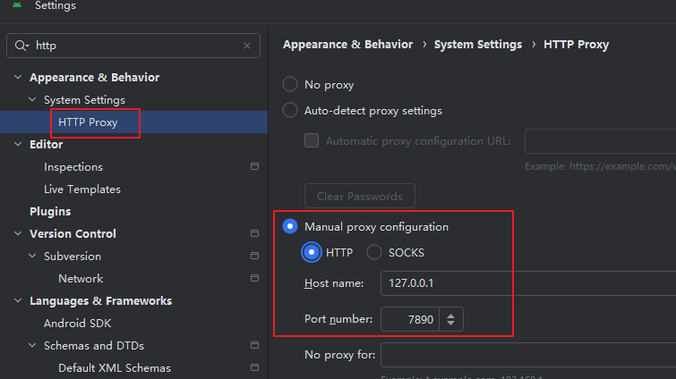
## 4.模拟器无法上网问题
参考博文：https://blog.51cto.com/u_16099252/14320445
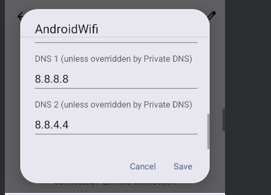
如果上不了网，尝试跟换DNS，114.114.114.114、8.8.8.8、8.8.4.4都试试看
## 5.Android studio在下载依赖时，报错Not in GZIP format.
### 问题原因：安卓系统镜像未下载完毕就关闭/结束创建虚拟机，导致本地存在不完整的镜像 zip 包，删除重新下载即可。
报错内容如下：
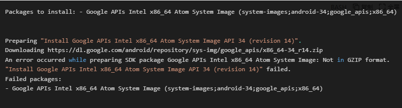
### 解决方案
Everything下载链接：https://www.voidtools.com/zh-cn/downloads/
推荐使用 Everything 搜索（不要直接在电脑的文件管理器搜索，很卡） Downloading https://dl.google.com/android/repository/sys-img/google_apis/x86_64-34_r14.zip 路径中的 zip 文件名 x86_64-34_r14.zip 后，删除（你搜索到的文件名可能类似 x86_64-34_r14.zip.asdownload）
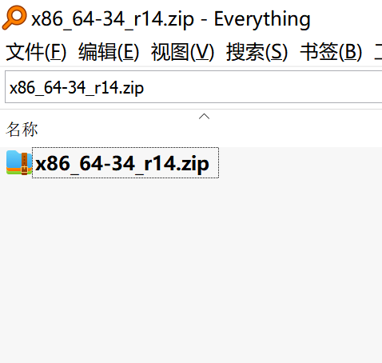
删除完对应文件，重新安装依赖即可
## 6.Android studio提示Android Gradle plugin requires Java 11 to run. You are currently using Java 1.8
### 原因：项目环境是需要java11，但是电脑系统环境变量配置的是java1.8版本（Android studio默认读取的是系统自身的jdk）
### 解决方法：直接重新在电脑配置对应版本的jdk版本环境变量即可
## 7.执行yarn android提示 Filename longer than 260 characters
项目文件目录层级或文件名称太长了，改短即可
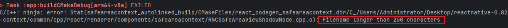
## 8.在APP根函数组件，不能使用memo包裹导出，会报错
## 9.StatusBar状态栏组件时，可以设置translucent属性，让状态栏背景透明，并且不设置状态栏占位，如果不设置translucent属性，同一android，不同机型，状态栏的占位表现不一样，有的会占位顶下导航栏、有的会与导航栏重叠
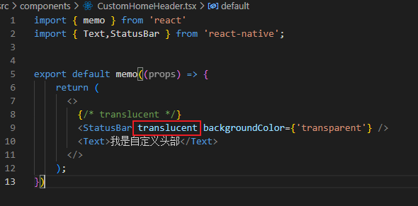
## 10.reactnative中的布局默认就是纵向的flex布局
## 11.有时使用联合声明类型的顺序会导致vscode等编辑器的类型提示不全，但是语法验证是正常的，只是没有类型提示
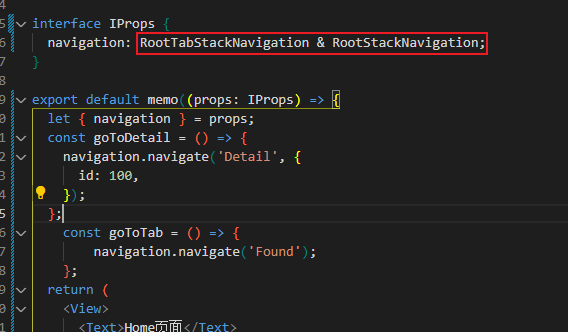
## 12.堆栈导航嵌套标签导航，堆栈导航跳转，也会导致标签导航重新渲染,所以，在此种嵌套的情况下，堆栈导航页面跳转到标签导航页面，最好用navigation.popTo方法，防止同时在内存中保留多份标签导航实例，占用内存，且会同时触发标签内部逻辑的执行
```
// ButtomsTabs为堆栈导航页，Found为标签导航页
navigation.popTo('ButtomsTabs', {
  screen:'Found'
});
```